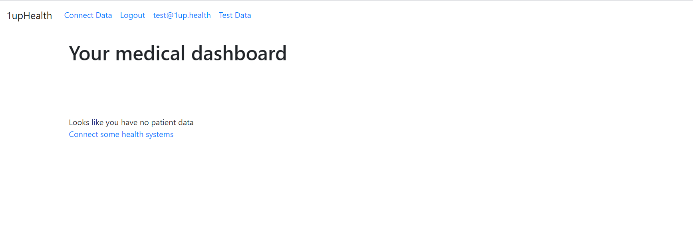
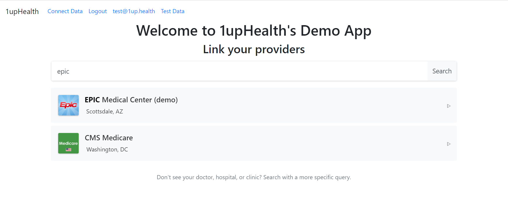
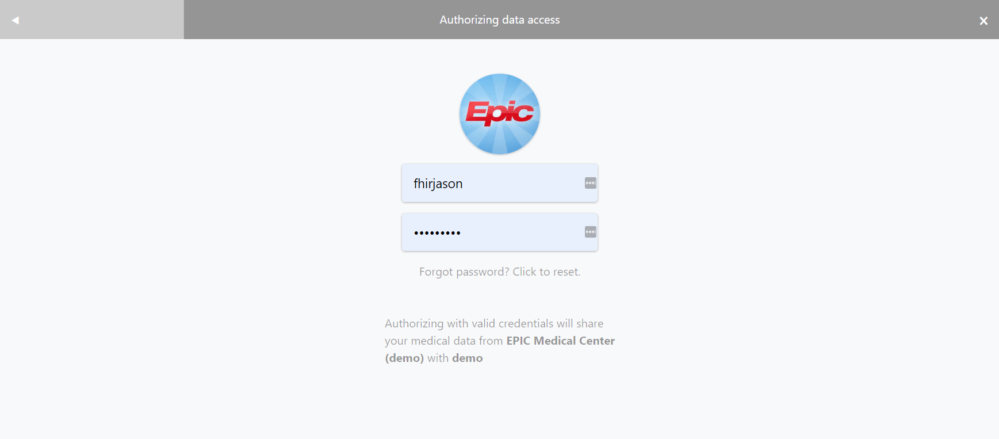

# 1up Health Demo Web Application
Example web application built using 1upHealth FHIR, User &amp; Connect APIs  

[](https://circleci.com/gh/1uphealth/1upwebapp)

## Before you start
Create an application via the 1uphealth devconsole [https://1up.health/devconsole](https://1up.health/devconsole) for testing purposes.  Use `http://localhost:3000/callback` for your app's callback url. Make sure you save your client secret as it'll only be shown once.

## Quickstart
1. Checkout source code from the repo
```
cd ~/
git clone https://github.com/1uphealth/1upwebapp.git
```


2. Add your API keys to app server session, ex. `vim ~/.bashrc` or `~/.bash_profile`
```
export ONEUP_DEMOWEBAPPLOCAL_CLIENTSECRET="clientsecretclientsecret"
export ONEUP_DEMOWEBAPPLOCAL_CLIENTID="clientidclientid"
```
save this
```
source ~/.bashrc
source ~/.bash_profile
```
**For Windows:** - Add your API keys as Environment Variables. 
- In Search, search for and then select: System (Control Panel)
- Click the Advanced system settings link.
- Click Environment Variables.
- In the Edit System Variable (or New System Variable) window, specify the value of the PATH environment variable.
- Reopen Command prompt window, and run your code. 

3. Create `config.json` configuration file with the same client_id
```
{
  "baseURL": "http://localhost:3000",
  "clientId": "xxxxxxx",
  "__clientId": "the client id must be hardcoded here because this will be client side",
  "email": {
    "sender": "address@demo.com"
  }
}
```

4. Install & run the app
```
npm install
npm run dev
```

5. Run the email server (python 2.7)
```
sudo python -m smtpd -n -c DebuggingServer localhost:25
```

## Test Health Systems
You can test the demo web app with one of these [FHIR health system accounts](https://1up.health/dev/doc/fhir-test-credentials).

## Connecting a Provider
The steps below show how to add a test user to the account, however the steps should be the same for regular patient data as well.

1. After following the above steps, go to http://localhost:3000 and login


2. Click on "Connect Data" in the navbar up top



3. Search for your provider (in this example its EPIC) and click on the result.



4. Enter your details into the provider site and authorize the application to access the data.



5. You will be redirected back to the dashboard.


## Optional Setup: Setup email using actual email (relay) server
Either run a test local server for development
```
sudo python -m smtpd -n -c DebuggingServer localhost:25
```
Or setup email js for production in `auth.js`
```
var email 	= require("emailjs");
var server 	= email.server.connect({
   user:    "username",
   password:"password",
   host:    "smtp.your-email.com",
   ssl:     true
});
```
